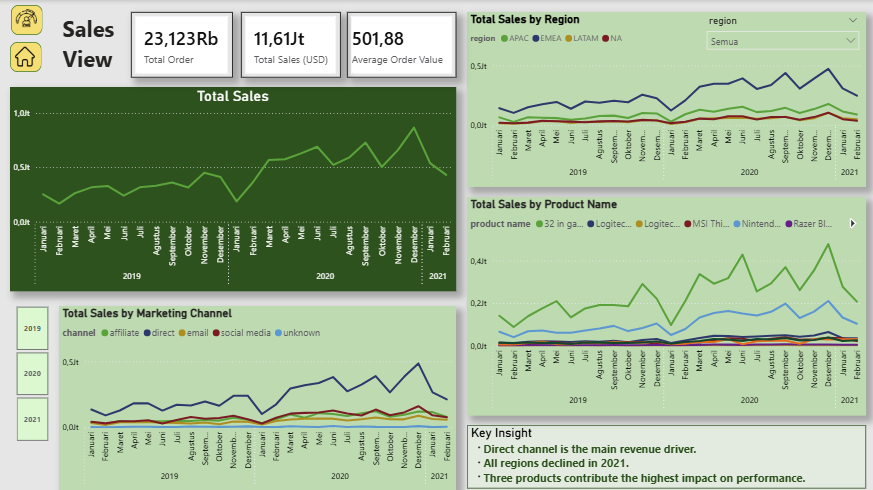

# Gaming Sales Dashboard - Power BI

## Overview
Interactive Power BI dashboard for gaming sales analysis including revenue trends, regional performance, product contribution, and marketing channel insights.

## Tools
- Power BI
- Excel

## Key Insights
- Direct channel is the main revenue driver
- Regional performance trends identified
- Product contribution analysis

## Dashboard Preview

## File
Download .pbix file in this repository.
